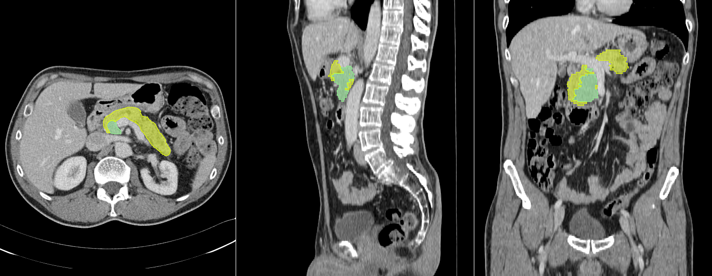

# Segmentation Package Repository

This repository contains the source code of the segmentation package. This package provides the training and test Jupyter notebooks based on a 2D Unet model. The module independently trains three 2D Unet models, namely axial, sagittal, and coronal models, and merges the results to attain an equivalent 2.5D segmentation network (see Figure 1). The training notebook (`00_Pancreas_Segmentation_2DUnet.ipynb`) loads the data and the labels, arranges and prepares them, builds the Unet model, runs the training, and stores the weights.

The test notebook computes three different pancreas segmentations, one for each axis (see Figure 2). The final pancreas segmentation is obtained by an integrated multi-view approach based on majority voting.

  
*Figure 1. 2.5D Unet architecture.*

## Folder Structure

To function correctly, the notebooks should be organized in a folder structure on Google Drive with a root folder named `PANCREAS_2.5D`, including the following subfolders:
- `Data`
- `Model`
- `Notebooks` (contains the notebooks)

The `Data` folder must contain three subfolders:
- `Axial` (containing original axial images)
- `Sagittal` (containing resampled lateral images)
- `Coronal` (containing resampled frontal images)

  
*Figure 2. Example of three image samples with annotations (pancreas and lesion).*

---

## Data Access

Written requests to access the datasets can be submitted to AIMS Academy at [virtualclonedataset@aimsacademy.org](mailto:virtualclonedataset@aimsacademy.org). AIMS Academy will evaluate requests based on the research objectives of the requesting entity. The data provider reserves the right to deny access or impose restrictions. For further information, please visit [https://www.aimsacademy.org/en/ct-image-dataset/](https://www.aimsacademy.org/en/ct-image-dataset/).
