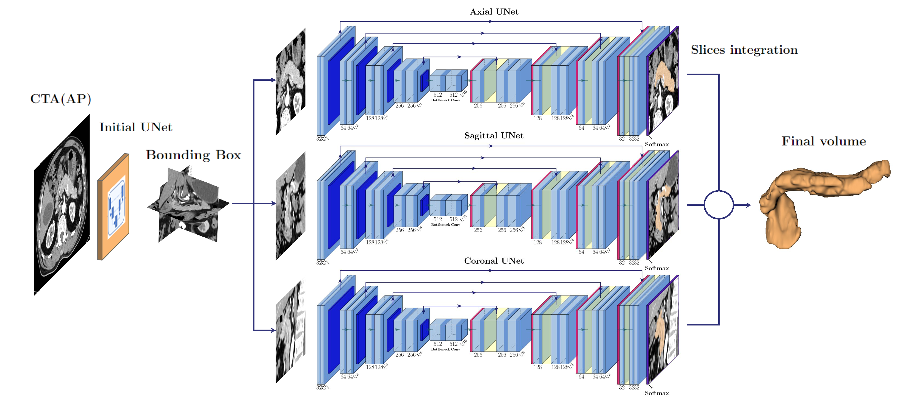

This repository contains the source code of the segmentation package. This package provides the training and test jupiter notebooks based on a 2D Unet model. In order to work, the notebooks have to be placed in a folder structure on Goolge Drive starting from a root we named PANCREAS_2.5D including the follwoing subfolders_
* Data
* Model
* Notebooks (which actually contains the notebooks). 

The data folder must contain 3D subfolders
Axial 		(containing original axial images)
Sagittal 	(containing resampled lateral images)
Coronal 	(containing resampled frontal images)

The module trains independetly three 2D Unet models, namely axial, sagitaal and coronal models and merge toghether the resuls to attain an equivalent 2.5D model. The test notebook computes three different pancreas segmentations, one for each axis. The final pancreas segmentation is obtained by an integrated multi-view approach based on majority voting.

